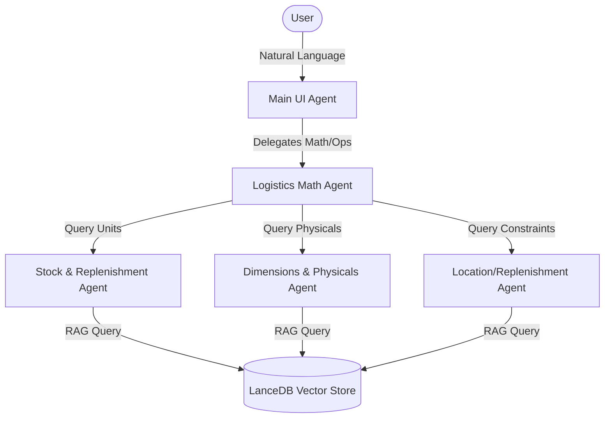

# Tiered Multi-Agent Warehouse Management System

This project implements an agentic, hierarchical Warehouse Management system using the `google-antigravity` Python SDK, powered by local vector RAG pipelines and a multi-format ingestion module.

## Architecture Layout

```
.
├── data/
│   └── lancedb_store/          # Local LanceDB vector database storage
├── logs/
│   └── trace_output.json       # Traces of agent interactions and decisions
├── src/
│   └── warehouse_system/
│       ├── __init__.py
│       ├── app.py              # Tiered Agent definitions and orchestration
│       ├── data_parser.py      # Ingests JSON, CSV, XML, EDI, and Markdown
│       ├── rag_pipeline.py     # LanceDB vector search setup
│       └── mock_data/          # Sample inventory files in various formats
│           ├── catalog.csv
│           ├── catalog.edi
│           ├── catalog.json
│           ├── catalog.xml
│           └── warehouse_catalog.md
├── README.md
└── test_system.py              # Main execution and verification script
```

## Agent Structure & Routing Path

The system is configured as a tiered hierarchical agent tree:



### 1. Main UI Agent
*   **Persona**: Conversational, user-facing assistant.
*   **Rule**: Explicitly prohibited from performing mathematical calculations.
*   **Routing**: Identifies operational or mathematical requests (e.g., reorder points, stock limits, or EOQ) and routes them to the **Logistics Math Agent** via `query_logistics_math_agent`.

### 2. Logistics Math Agent
*   **Persona**: Focuses strictly on calculating formulas and checking constraints.
*   **Rule**: Must not guess numbers. Must query child sub-agents for inventory metrics and then calculate formulas.
*   **Tools**:
    *   `calculate_eoq(annual_demand, order_cost, holding_cost)`: Economic Order Quantity formula: \(\sqrt{\frac{2DS}{H}}\)
    *   `calculate_rop(daily_demand, lead_time, safety_stock)`: Reorder Point formula: \((d \times L) + SS\)
    *   `check_rack_constraints(...)`: Compares item dimensions and weight against physical rack limits to determine capacity fit.
*   **Routing**: Spawns and delegates data lookups to three dedicated domain data child sub-agents.

### 3. Domain Data Sub-Agents (Child Agents)
*   **Stock & Replenishment Agent**: Retrieves stock levels, safety stock units, and thresholds from LanceDB.
*   **Dimensions & Physicals Agent**: Queries item weight, box dimensions, volume, and warehouse grid coordinates.
*   **Location/Replenishment Agent**: Looks up target rack weight/volume capacities and lead times.

---

## LLM & AI Core Providers

The hierarchical agent reasoning and vector embedding layers utilize the following model setups:

1.  **Primary LLM Agent Engine**: `meta/llama-3.1-8b-instruct` (or `Llama-3-Nemotron-70B-Instruct`) hosted via the **Nvidia NIM API**. This model drives the multi-agent coordination, sequential tool-calling loops, and natural-language formatting.
2.  **Vector Embedding Engine**: `text-embedding-004` via the **Gemini Developer API** to project catalog text segments into a 128-dimensional vector space.
3.  **Local Embedding Fallback**: A self-contained FNV-1a hashing vectorizer that runs instantly if Gemini API keys are omitted or rate-limited.
4.  **Local Agent Reasoning Fallback**: A local rule-based deterministic emulator that runs the exact same child agent queries and stockpyl math tools locally to guarantee 100% chatbot uptime.

These credentials are configured securely using a local, git-ignored `.env` file.

---

## Data Ingestion & RAG Pipeline

The ingestion layer (`data_parser.py`) converts multiple incoming formats into a standardized dictionary layout:

1.  **JSON**: Standard record objects.
2.  **CSV**: Tabular rows mapped to columns.
3.  **XML**: Nested `<sku_item>` trees.
4.  **EDI**: ANSI X12-inspired segment strings (split by `~` and `*`).
5.  **Markdown (MD)**: Structured section blocks split by SKU headers.

Records are passed to `rag_pipeline.py`, which generates a 128-dimensional hashing vector embedding and saves the record in **LanceDB**, supporting fast local semantic search.

---

## Running the System Verification

To install dependencies, ingest data, and trigger the multi-agent decision loop:

```bash
# Install the Google Antigravity SDK and LanceDB
pip install google-antigravity lancedb numpy

# Run the test system
python test_system.py
```

The system will:
1.  Parse and ingest all source files in `src/warehouse_system/mock_data/` into LanceDB.
2.  Send the query: *"We are running low on SKU-8821. Figure out if we need to order more based on our physical rack constraints and calculate the EOQ."*
3.  Execute the nested agent chain (Main UI Agent -> Logistics Math Agent -> Data Sub-Agents -> Math calculations).
4.  Output the final response and save the call trace to `logs/trace_output.json`.
